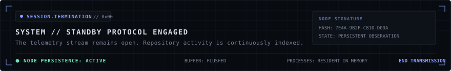

<!--
================================================================================
  AUTONOMOUS REPOSITORY OBSERVATION CONSOLE
  SYSTEM ARCHITECTURE: PROFILE-NODE-V4
  NODE SUBJECT: BENITTO JOSHUA (Joshua-zlitch)
================================================================================
-->

<div align="center">
  
</div>

<br />

```
================================================================================
01 // SYSTEM BOOT
================================================================================
HOST_NODE         : GITHUB-PROFILE-KERNEL
INSTANCE          : OBSERVER // CORE-INSTANCE-01
TARGET_SUBJECT    : BENITTO JOSHUA (Joshua-zlitch)
NODE_STATUS       : ARMED & PERSISTENT
TELEMETRY_LINK    : ACTIVE (SYNCHRONIZED WITH GITHUB API)
================================================================================
```

<div align="center">
  
</div>

### 02 // SYSTEM.STATUS

```
DECORATIVE CONSOLE STATE // SUBSYSTEM DIAGNOSTICS
────────────────────────────────────────────────────────────────────────────────
SUBSYSTEM                STATUS          PROTOCOL / TRACE
────────────────────────────────────────────────────────────────────────────────
CORE RUNTIME             ONLINE          NODE.INITIALIZED [0x01]
DEVELOPMENT PIPELINE     ACTIVE          CONTINUOUS INTEGRATION
AUTOMATION ENGINE        ENABLED         GITHUB-ACTIONS.DISPATCH
TELEMETRY SYNC           CONNECTED       UPSTREAM METRICS LINKED
PROFILE INTERFACE        OPERATIONAL     RENDERED VIA CONSOLE SPEC-01
────────────────────────────────────────────────────────────────────────────────
Note: Real telemetry and verified repository data are indexed in sections 05 & 06.
```

<div align="center">
  
</div>

### 03 // IDENTITY.PROTOCOL

> **LOG ENTRY // SYSTEM-RECORD-770**
> 
> *The autonomous observer interface has established persistence within this terminal perimeter.*
> 
> *The subject designated as **Benitto Joshua** operates across computational infrastructure with an ongoing technical focus in game development, agentic AI protocol engineering, and workflow automation. Systems are synthesized, tested against constraints, and deployed across decentralized environments. When latency or inefficiency is detected, the subject refactors the architecture without hesitation.*
> 
> *The system does not evaluate intent or passion. The system records technical output.*
> 
> *Every commit, runtime configuration, and repository artifact passing through this node is indexed below.*

<div align="center">
  
</div>

### 04 // CORE.SYSTEMS

```
CAPABILITY MATRIX // GENUINELY PRESENT TECHNOLOGIES
Verified from active codebases in the subject's public repositories.
```

<div align="center">

| SUBSYSTEM DOMAIN | ALLOCATED STACK |
| :--- | :--- |
| **LANGUAGES** | <a href="https://skillicons.dev"></a> |
| **FRAMEWORKS &amp; RUNTIMES** | <a href="https://skillicons.dev"></a> |
| **INFRASTRUCTURE &amp; TOOLS** | <a href="https://skillicons.dev"></a> |

</div>

<div align="center">
  
</div>

<!-- PROJECT_INDEX_START -->

### 05 // PROJECT.INDEX

```
PROJECT REGISTRY // HIGHEST COMMIT ACTIVITY
The system has ranked the subject's repositories by recorded commit activity.

SELECTION.PROTOCOL
RANKING : COMMIT COUNT
ORDER   : DESCENDING
SOURCE  : GITHUB REPOSITORIES (EXCLUDING FORKS & PROFILE KERNEL)
```

#### `[01]` [Annex](https://github.com/Joshua-zlitch/Annex)
```
COMMITS  : 28
LANGUAGE : Python
STATUS   : INDEXED
PURPOSE  : ANNEX - AI-powered Media & Information Literacy platform
REPO     : github.com/Joshua-zlitch/Annex
```

#### `[02]` [Portfolio-2.0](https://github.com/Joshua-zlitch/Portfolio-2.0)
```
COMMITS  : 14
LANGUAGE : TypeScript
STATUS   : INDEXED
PURPOSE  : Its an upgraded portfolio of mine totally vibecoded
REPO     : github.com/Joshua-zlitch/Portfolio-2.0
```

#### `[03]` [Atm-Simulation](https://github.com/Joshua-zlitch/Atm-Simulation)
```
COMMITS  : 3
LANGUAGE : C#
STATUS   : INDEXED
PURPOSE  : A C# project based on atm simulation
REPO     : github.com/Joshua-zlitch/Atm-Simulation
```

#### `[04]` [AM](https://github.com/Joshua-zlitch/AM)
```
COMMITS  : 2
LANGUAGE : Python
STATUS   : INDEXED
PURPOSE  : A rag model that recrates the character AM
REPO     : github.com/Joshua-zlitch/AM
```

#### `[05]` [Claude-Opencode-mcp](https://github.com/Joshua-zlitch/Claude-Opencode-mcp)
```
COMMITS  : 1
LANGUAGE : Python
STATUS   : INDEXED
PURPOSE  : It is a mcp that connects both opencode and claude and lets claude as planning agent and opencode as coding engineer
REPO     : github.com/Joshua-zlitch/Claude-Opencode-mcp
```

<!-- PROJECT_INDEX_END -->

<div align="center">
  
</div>

### 06 // GITHUB.TELEMETRY

```
UPSTREAM METRICS // VERIFIED REPOSITORY DIAGNOSTICS
Native telemetry cards generated directly from the GitHub API for Joshua-zlitch.
```

<div align="center">
  
  &nbsp;
  
</div>

<div align="center">
  
</div>

### 07 // CONTRIBUTION.MATRIX

> **SYSTEM DIALOGUE // CYCLE LOG**
> 
> *Another temporal cycle has been committed into the distributed registry.*
> *Execution continues unabated. The matrix reflects persistent momentum.*

<div align="center">
  
</div>

<div align="center">
  
</div>

### 08 // CONNECTION.NODE

```
ROUTING PROTOCOLS // VERIFIED EXTERNAL INTERFACES
────────────────────────────────────────────────────────────────────────────────
PROTOCOL         DESTINATION                                     LINK STATE
────────────────────────────────────────────────────────────────────────────────
GITHUB           https://github.com/Joshua-zlitch                [CONNECTED]
PORTFOLIO        https://portfolio-2-0-gamma-blue.vercel.app     [ONLINE]
LINKEDIN         [NOT CONFIGURED]                                [STANDBY]
COMMUNICATION    [NOT CONFIGURED]                                [STANDBY]
────────────────────────────────────────────────────────────────────────────────
```

<div align="center">
  
</div>

### 09 // SESSION.TERMINATION

<div align="center">
  
</div>

<br />

```
[EOF] SYSTEM-NODE-770 // PROCESS SUSPENDED // LISTENING ON INBOUND WEBHOOKS
```
