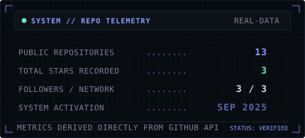
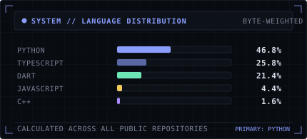
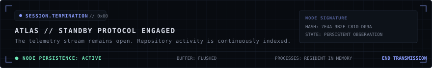

<!--
================================================================================
  ATLAS // AUTONOMOUS REPOSITORY OBSERVATION CONSOLE
  SYSTEM ARCHITECTURE: PROFILE-NODE-V4
  NODE SUBJECT: BENITTO JOSHUA (Joshua-zlitch)
================================================================================
-->

<div align="center">
  
</div>

<br />

```
================================================================================
01 // SYSTEM BOOT
================================================================================
HOST_NODE         : GITHUB-PROFILE-KERNEL
INSTANCE          : ATLAS // OBSERVER-INSTANCE-01
TARGET_SUBJECT    : BENITTO JOSHUA (Joshua-zlitch)
NODE_STATUS       : ARMED & PERSISTENT
TELEMETRY_LINK    : ACTIVE (SYNCHRONIZED WITH GITHUB API)
================================================================================
```

<div align="center">
  
</div>

### 02 // SYSTEM.STATUS

```
DECORATIVE CONSOLE STATE // SUBSYSTEM DIAGNOSTICS
────────────────────────────────────────────────────────────────────────────────
SUBSYSTEM                STATUS          PROTOCOL / TRACE
────────────────────────────────────────────────────────────────────────────────
CORE RUNTIME             ONLINE          NODE.INITIALIZED [0x01]
DEVELOPMENT PIPELINE     ACTIVE          CONTINUOUS INTEGRATION
AUTOMATION ENGINE        ENABLED         GITHUB-ACTIONS.DISPATCH
TELEMETRY SYNC           CONNECTED       UPSTREAM METRICS LINKED
PROFILE INTERFACE        OPERATIONAL     RENDERED VIA ATLAS SPEC-01
────────────────────────────────────────────────────────────────────────────────
Note: Real telemetry and verified repository data are indexed in sections 05 & 06.
```

<div align="center">
  
</div>

### 03 // IDENTITY.PROTOCOL

> **LOG ENTRY // ATLAS-RECORD-770**
> 
> *The observer designated as ATLAS has established persistence within this terminal perimeter.*
> 
> *The subject designated as **Benitto Joshua** operates across computational infrastructure with an ongoing technical focus in game development, agentic AI protocol engineering, and workflow automation. Systems are synthesized, tested against constraints, and deployed across decentralized environments. When latency or inefficiency is detected, the subject refactors the architecture without hesitation.*
> 
> *ATLAS does not evaluate intent or passion. ATLAS records technical output.*
> 
> *Every commit, runtime configuration, and repository artifact passing through this node is indexed below.*

<div align="center">
  
</div>

### 04 // CORE.SYSTEMS

```
CAPABILITY MATRIX // GENUINELY PRESENT TECHNOLOGIES
Verified from active codebases in the subject's public repositories.
```

<div align="center">

| SUBSYSTEM DOMAIN | ALLOCATED STACK |
| :--- | :--- |
| **LANGUAGES** | <a href="https://skillicons.dev"></a> |
| **FRAMEWORKS &amp; RUNTIMES** | <a href="https://skillicons.dev"></a> |
| **INFRASTRUCTURE &amp; TOOLS** | <a href="https://skillicons.dev"></a> |

</div>

<div align="center">
  
</div>

### 05 // PROJECT.INDEX

```
REGISTRY IDENTIFIER // RECORDED REPOSITORIES
────────────────────────────────────────────────────────────────────────────────
Indexed directly from public repositories under github.com/Joshua-zlitch.
────────────────────────────────────────────────────────────────────────────────
```

#### `[01]` [Claude-Opencode-mcp](https://github.com/Joshua-zlitch/Claude-Opencode-mcp)
```
STATUS   : INDEXED
SYSTEM   : PYTHON // MODEL CONTEXT PROTOCOL (MCP) & AGENTIC WORKFLOWS
PURPOSE  : MCP bridge connecting OpenCode and Claude, deploying Claude as planning agent and OpenCode as coding engineer.
```

#### `[02]` [FluxDesk](https://github.com/Joshua-zlitch/FluxDesk)
```
STATUS   : INDEXED
SYSTEM   : WINDOWS UTILITY // SYSTEM AUTOMATION & WORKFLOWS
PURPOSE  : Offline utility preparing laptop environments for Study, Development, Gaming, or Relaxation with Lenovo Vantage integration.
```

#### `[03]` [Portfolio-2.0](https://github.com/Joshua-zlitch/Portfolio-2.0)
```
STATUS   : INDEXED
SYSTEM   : REACT 19 // TYPESCRIPT // VITE // TAILWIND CSS
PURPOSE  : Upgraded interactive web application with custom Framer Motion transitions and responsive UI architecture.
```

#### `[04]` [AM](https://github.com/Joshua-zlitch/AM)
```
STATUS   : INDEXED
SYSTEM   : PYTHON // RETRIEVAL-AUGMENTED GENERATION (RAG)
PURPOSE  : RAG model synthesizing persona-driven dialogue generation and structured knowledge retrieval.
```

#### `[05]` [Stock-Management](https://github.com/Joshua-zlitch/Stock-Management)
```
STATUS   : INDEXED
SYSTEM   : TYPESCRIPT // REACT 19 // VITE // TAILWIND CSS
PURPOSE  : Digital stock and inventory management platform featuring barcode scanning and tabular reporting exports.
```

<div align="center">
  
</div>

### 06 // GITHUB.TELEMETRY

```
UPSTREAM METRICS // VERIFIED REPOSITORY DIAGNOSTICS
Native ATLAS telemetry cards generated directly from the GitHub API for Joshua-zlitch.
```

<div align="center">
  
  &nbsp;
  
</div>

<div align="center">
  
</div>

### 07 // CONTRIBUTION.MATRIX

> **ATLAS DIALOGUE // CYCLE LOG**
> 
> *Another temporal cycle has been committed into the distributed registry.*
> *Execution continues unabated. The matrix reflects persistent momentum.*

<div align="center">
  
</div>

<div align="center">
  
</div>

### 08 // CONNECTION.NODE

```
ROUTING PROTOCOLS // VERIFIED EXTERNAL INTERFACES
────────────────────────────────────────────────────────────────────────────────
PROTOCOL         DESTINATION                                     LINK STATE
────────────────────────────────────────────────────────────────────────────────
GITHUB           https://github.com/Joshua-zlitch                [CONNECTED]
PORTFOLIO        https://portfolio-2-0-gamma-blue.vercel.app     [ONLINE]
LINKEDIN         [NOT CONFIGURED]                                [STANDBY]
COMMUNICATION    [NOT CONFIGURED]                                [STANDBY]
────────────────────────────────────────────────────────────────────────────────
```

<div align="center">
  
</div>

### 09 // SESSION.TERMINATION

<div align="center">
  
</div>

<br />

```
[EOF] ATLAS-NODE-770 // PROCESS SUSPENDED // LISTENING ON INBOUND WEBHOOKS
```
